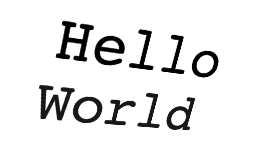
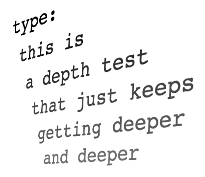

# lewdo
lewdo : a text-based 3D interface

https://leweyg.github.io/lewdo/index.html

# Introduction
'lewdo' is a text-based 3D windowing and application environment. Both the output display and input systems are modelled as simply 3d buffers of text with update events (see [string3](#string3)). Much as UNIX processes have 'standard in' and 'standard out' file streams associated with each, [lewdo applications](#lewdo_app) use a 3d buffer (with frame update events) to model both the standard input and standard output streams of the application. Sub-processes can then be created to host inner content, such as buttons or labels, and user interfaces can be naturally built out there-by. Currently it is hosted within an HTML page as pure CSS; WebGL/XR and Unity versions are in the works.

### Background

Designing a 3D interface is a complex problem; 'lewdo' attempts to tackle a subset of these design problems within the somewhat artificial context of a purely 'text-based 3d interface'. It contains numerous apps, and data models to explore interaction within that environment.

Also yes, the author ( <a href="http://www.lewcid.com/lg/aboutme.html">Lewey Geselowitz</a> ), is aware that non-text-based 3D interfaces exist and provide additional levels of control than ASCII allows (he generally works on AR/MR/VR and even <a href="http://www.4dprocess.com/4d/index.html">4D interfaces</a>). This effort is mostly just a test of the idea of an XR system-terminal interface within which both the input and output are similarly typed 3d 'scenes' (as AR/XR get more complex, the description of the input scene and output scene formats are tending towards unification; see his work on <a href="https://unity.com/products/unity-mars">Unity MARS</a>, a useful tool for simulating complex environments as application inputs); plus it reminds him of the old-days when every letter mattered; while also providing space to really explore 3D interaction in a pure context.

## Example App

    function helloWorld(app) {
        app.app_out.copy(string3("Hello\v\nWorld"));
        app.app_out.frameStep();
    }
    lewdo_app_prototype.all_apps.apps["helloWorld"] = helloWorld;

This application outputs a 3D "Hello World" to the display, with "Hello" at the closest depth, and "World" below that. `string3` treats the `\n` as `New Line`, but the `\v` is interpreted as `New Page`. The call to `frameStep()` informs any subscribers that the frame is now ready to be recieved (common in graphics architectures). Also the line at the bottom add this method to the standard list of apps.

## Example App with Input

For an example app which reads it's input and repeats it back volumetrically, see [repeatMe.js](lewdo/examples/repeatMe.js)

# Scripting Reference

## lewdo_app

`lewdo_app()` creates a new app instance with the following default properties. Most "applications" are actually methods that take an app instance as input, and interact via subscriptions to it's input and output buffers.

| Property | Type | Description |
| ----- | ----- | ------ |
| app_out | string3 | Output/display buffer stream |
| app_in | string3 | Input buffer stream |

## string3

`string3()` creates a 3d buffer of characters, arranged by width, height and then depth into a 1D array of strings, along with an event subscription system.

| Property | Type | Description |
| ----- | ----- | ------ |
| width | number | voxel width of the stream's current frame |
| height | number | voxel height of the stream's current frame |
| depth | number | voxel depth of the stream's current frame |
| array1d | [ string ] | an array of characters |
| frame | number | current frame index (should only go up) |
| subscribers | [ (string3) ] | array of callbacks subscribed to the string3 |

| Method | Arguements | Description |
| ----- | ----- | ------ |
| string3 | () or (string) | creates a new string3, parsing '\v' as new page, and '\n' as new line. |
| copy | (string3) | copies another string3 |
| frameStep | () | increased frame index, and notified subscribers |
| subscribe | (callback(string3)) | gives the current and subsequent frames to the subscriber |
| resize | (w,h,d,string) | resizes the volume |
| clear | (string) | clears the volume to a common value |
| sizeXYZ | () | returns an XYZ with the width, height and depth |
| drawTextXYZ | (string,xyz) | draws text as string3 starting at the given xyz vector |
| visitEach | (callback(string,x,y,z)) | visits each voxel providing it's value and location |
| setByXYZ | (string,xyz) | sets this value into the given xyz |
| getByXYZ | (xyz) | returns the value at the given xyz |
| subString3XYZ | (xyz,xyz) | returns a new string3 with the subset of the current volume, starting at the first xyz and ending at the second. The default for start is 0,0,0 and for the end is the size of the volume. |
| indexFromSeperateXYZ | (x,y,z) | returns the 1D index of the given x,y,z tuple |
| indexFromXYZ | (xyz) | returns the 1D index of the given xyz tuple |

## string3_util.xyz

`string3_util.xyz()` is a simple wrapper for an object with the properties x, y and z. If not given arguements it defaults to `{x:0,y:0,z:0}`. It is used to represent a 3D location in the string3 API.

| Property | Type | Description |
| ----- | ----- | ------ |
| x | number | voxel width of the stream's current frame |
| y | number | voxel height of the stream's current frame |
| z | number | voxel depth of the stream's current frame |

And associated methods:

| Method | Arguements | Description |
| ----- | ----- | ------ |
| string3_util.xyz | () or (x,y,z) | create an XYZ object with default or passed in values |
| copy | (xyz) | copies another xyz |
| set | (x,y,z) | changes the x, y and z values |
| clone | () | returns a new object with the same xyz values |
